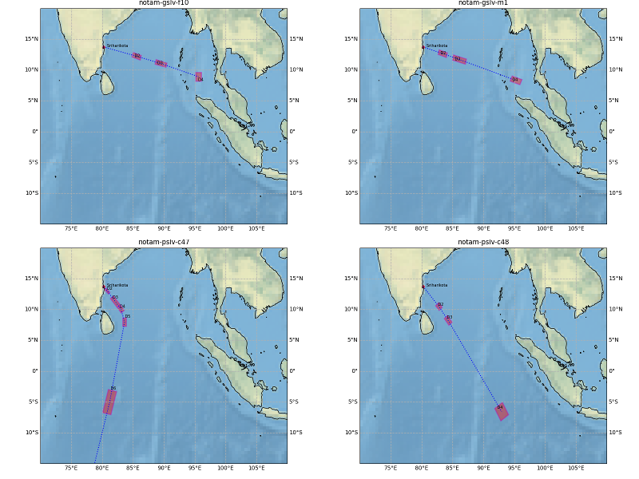

# NOTAM-Mapper
> This script reads the NOTAM (Notice To Airmen) file and generates a map with danger zones marked on it.    

&nbsp;    
####UPDATE [28-OCT-2020]:     
Since Basemap is deprecated in favor of the Cartopy modules ( https://matplotlib.org/basemap/ ),     
I have modified the code to replace basemap functions with Cartopy    
&nbsp;    

## Table of contents
* [General info](#general-info)
* [Screenshots](#screenshots)
* [Setup](#setup)
* [How to run ](#how)
* [To-do list](#to-do)

## General info
Current version of this project is written for rocket launches from ISRO (Indian Space Research Organization). NOTAM'S issued for few ISRO launches were used as test cases and are included under the directory named 'test' 

## Screenshots
Outputs produced by the script in running with the NOTAMs issued for the launches of PSLV-C47, PSLV-C48, GSLV-F10 and GSLV-M1.    

   

## Setup
Script is written with python (Version: 3.6.9) on linux. Additional modules required:   

* numpy  (tested with Version: 1.19.2 )
* matplotlib  (tested with Version: 3.3.2  )
* ~~basemap ( tested with Version: 1.1.0 )~~
* Cartopy ( tested with Version: 0.18.0 )

## How to run   
* Sample NOTAMs are placed in the test directory (say we pick notam-gslv-f10.txt)
* edit code at line no.239 (around) to read the new NOTAM.  
 `notam_filename = "./test/notam-gslv-f10.txt" `   
* run `python notam-mapper.py`. It
generates a png file and shows the plot.

## To-do list
* This initial version is ISRO specific and the map boundaries are hard-coded. This could be made automatic by taking min-max values of latitude/longitude read through the danger zones. Another way is to store specific boundaries for each launch port in a dictionary and display them accordingly. 
* Need to test with NOTAMS of others launch agencies and modify the code accordingly.    
* Script could be modified to be as a bot running for twitter, reddit etc.

